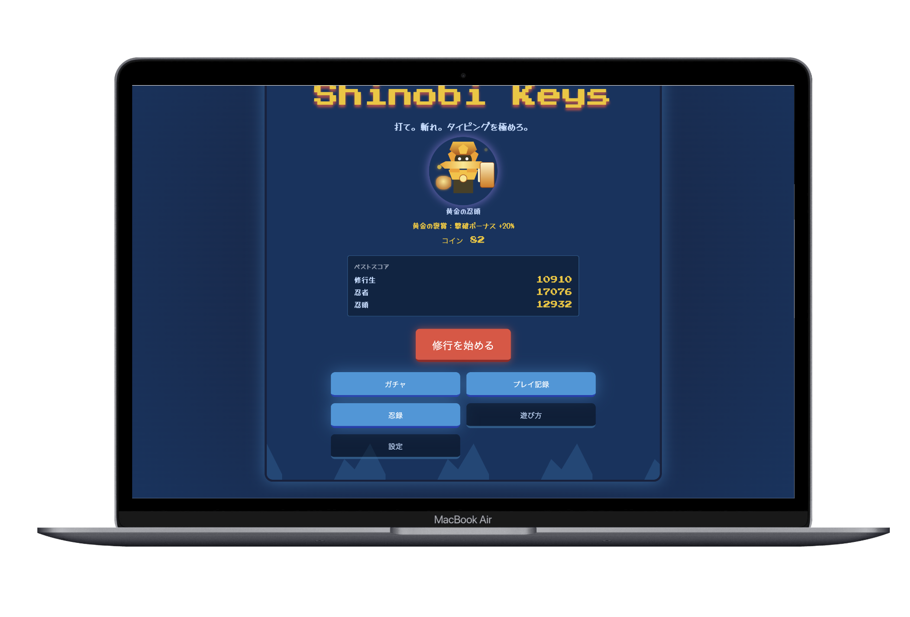
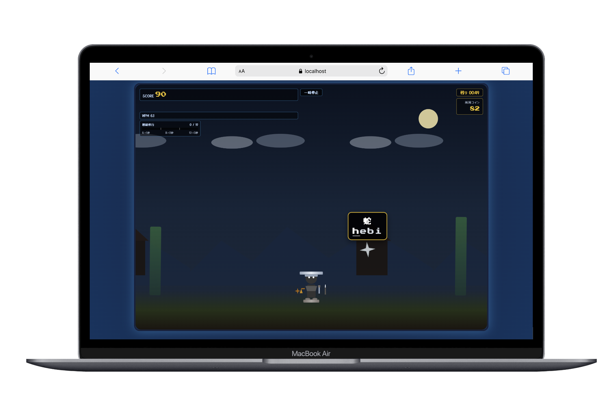
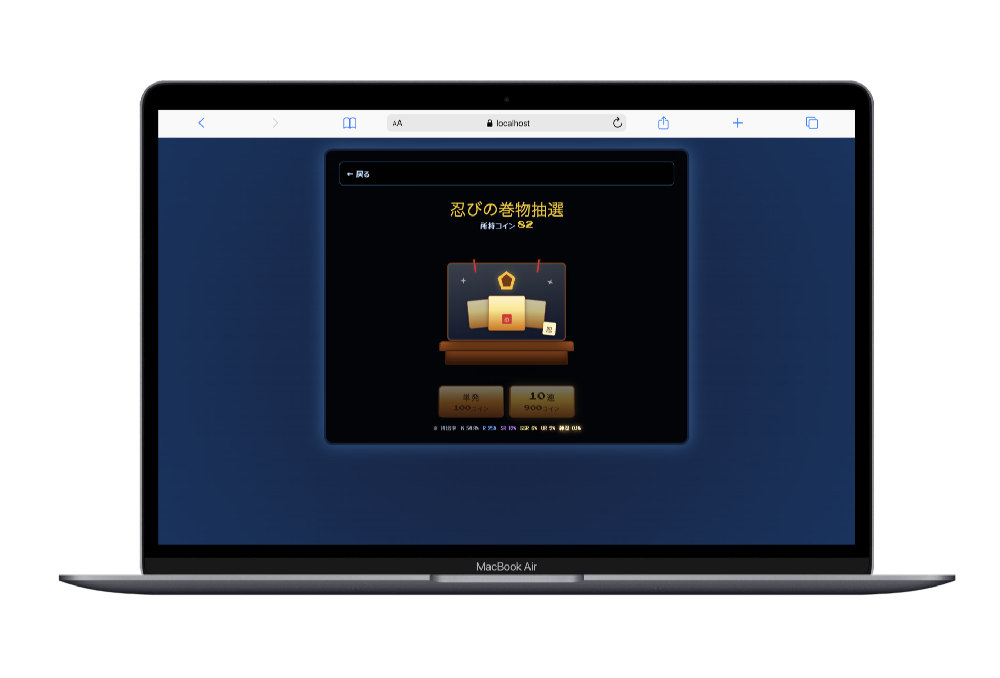
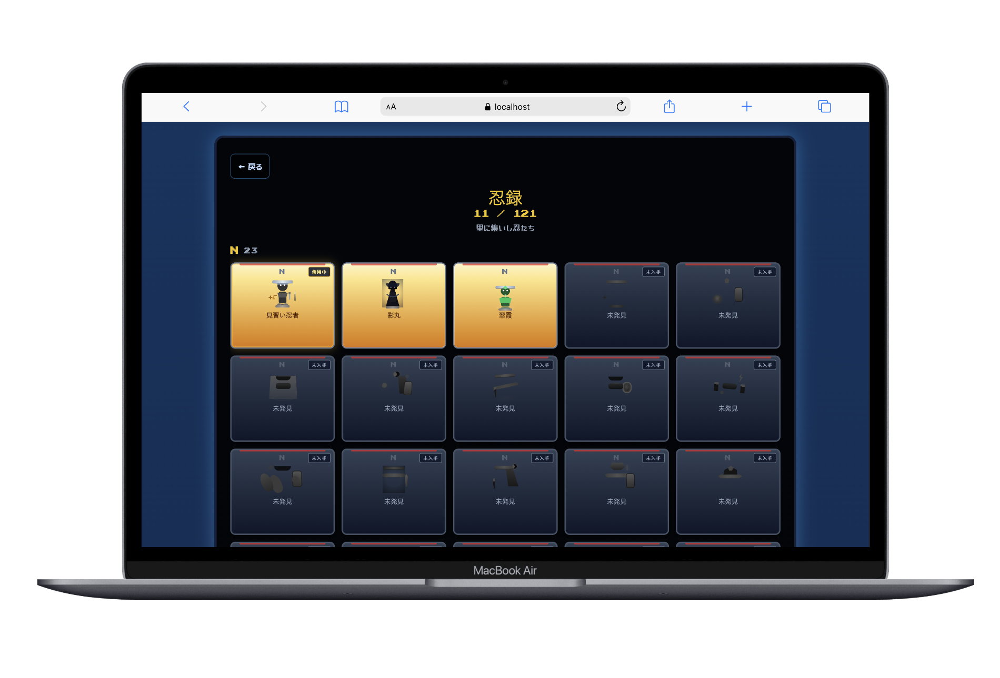

# Shinobi Keys

忍者の世界観で楽しむ、落下式ローマ字タイピング修行ゲームです。  
制限時間内にスコアを伸ばし、コインでガチャを回して **121 体** の忍者を集めながら、何度でも修行に挑めます。

---

## アプリケーション概要

ブラウザで遊べる **日本語ローマ字タイピングゲーム** です。落下する敵手裏剣の文字を入力して迎撃し、制限時間内にスコアを競います。

- 1 問ずつ出題する落下式タイピング
- 難易度 3 段階（60 / 90 / 120 秒）
- 600 問以上・ローマ字表記ゆれ対応
- 121 体のキャラ収集と能力差分
- ガチャ・忍録・プレイ記録

---

## サービスへの想い

タイピング練習は、続けるほど上達する一方で、単調になりやすいものです。  
Shinobi Keys では、**ゲームとして楽しめる体験** にすることで、短い時間でもまた開きたくなるアプリを目指しました。

1 問ずつ集中して打つ落下式、制限時間内のスコア争い、キャラクター収集——  
「修行」という世界観の中で、自然と繰り返しプレイできる設計にしています。

---

## 主な機能

| 機能 | 内容 |
| --- | --- |
| タイピング | 日本語＋ローマ字入力。1 問ずつ出題 |
| 難易度 | 修行生 / 忍者 / 忍頭 |
| スコア・コンボ | 連続成功でコンボ上昇・時間・コイン報酬 |
| コイン | 撃破ボーナス・連続成功・リザルト報酬 |
| キャラクター | 121 体（6 レア度）。CSS 表現 |
| 能力 | スコア・時間・コンボ・コインなど各種補正 |
| ガチャ | 単発 100 / 10 連 900 コイン。レア度別演出 |
| 忍録 | 収集一覧・所持キャラ選択 |
| 記録 | 難易度別ベスト・履歴（localStorage） |
| 設定 | 音量・ミュート・モーション |

---

## 技術スタック

| 区分 | 技術 |
| --- | --- |
| フロントエンド |     |
| テスト |   |
| データ保存 |  |
| 開発ツール |    |

---

## アプリの画面

| タイトル画面 | ゲーム画面 |
| :---: | :---: |
|  |  |
| ガチャ画面 | 忍録画面 |
|  |  |

---

## ローカル起動

### 前提

- Node.js / npm
- モダンブラウザ

### 開発サーバー

```bash
npm install
npm run dev
```

### ビルド・プレビュー

```bash
npm run build
npm run preview
```

### テスト

```bash
npm run lint
npm run test
npm run test:e2e
```

---

## ディレクトリ構成（主要部分）

```
src/
├── screens/          # 各画面
├── components/       # UI 部品
├── features/game/    # ゲームロジック
├── config/           # 難易度・キャラ・ガチャ
├── data/problems/    # 問題データ
├── utils/            # ローマ字判定・ストレージ
├── hooks/
└── audio/
```

---

## 今後の展望

- 苦手キー・問題の記録と練習内容の調整
- イベント・限定ガチャ
- 実績バッジ
- リアルタイム 1 対 1 対戦
- フレンド対戦
