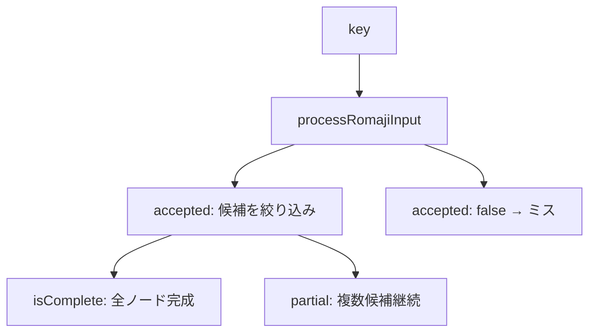

# Shinobi Keys — Phase 3 実装計画

**ステータス:** 計画のみ（未着手）  
**前提:** Phase 2 コミット済み（`043608e feat: implement phase 2 core gameplay`）  
**スコープ:** タイピング判定・日本語問題・入力統計。localStorage / 音 / 一時停止は Phase 4 以降

---

## 1. Phase 3 の目的

Phase 2 の「単一ローマ字文字列マッチ」を、**日本語表示 + ローマ字入力** に統一し、複数入力候補に対応可能な判定基盤を構築する。同時に WPM・正確率・詳細入力統計をゲーム内で計測し、HUD / リザルトへ反映する。

---

## 2. 問題表示の仕様変更（必須）

### 2.1 廃止する形式

- 英単語をそのまま出題する形式（`moon`, `mountain`, `programming` 等）
- `displayText` と `inputText` が英語のまま並ぶ形式
- 日本語と無関係な英語カテゴリ問題

### 2.2 採用する表示形式

落下ターゲット内は **2行構成** とする。

```text
やま          ← 日本語（displayText）
yama          ← 代表ローマ字（romajiPatterns[0]）
```

入力進捗は **代表ローマ字行** に対して Phase 2 と同様の色分けを適用する。

| 状態 | 表現 |
|------|------|
| 入力済み | 成功色（`char-correct`） |
| 次の文字 | 強調（`char-current`） |
| 未入力 | 通常色（`char-pending`） |
| ロックオン | 枠線・光彩強調（現行維持） |
| ミス | シェイク（現行維持） |

### 2.3 表示と判定の分離

- **画面表示:** `romajiPatterns[0]`（代表ローマ字）のみ
- **入力判定:** `romajiMatcher` が `romajiPatterns` 全候補 + 将来拡張ルールを参照
- 代表と異なる入力（例: `sinobi`）でも正解扱い可能にする

---

## 3. 問題データ構造の更新

### 3.1 新しい型（`src/types/typing.ts` 新規）

```ts
export interface TypingProblem {
  id: string
  displayText: string       // 画面表示用日本語（例: "しのび"）
  reading: string           // 読み（かな。例: "しのび"）
  romajiPatterns: string[]  // 完成形候補（先頭が代表表示）
  difficulty: DifficultyId
  category: ProblemCategory
  baseScore: number
}
```

### 3.2 データ移行方針

| Phase 2 | Phase 3 |
|---------|---------|
| `BasicTypingProblem.inputText` | 廃止 → `romajiPatterns` へ |
| 英語-only 問題 | 日本語 + ローマ字へ置換 |
| `category: 'english'` | 段階的に `basic` / `phrase` / `it` 等へ再分類 |

**代表ローマ字の決め方:** `romajiPatterns[0]` を画面表示・ロックオン先頭文字判定の代表とする。

**データ例:**

```ts
{
  id: 'nj-shinobi',
  displayText: 'しのび',
  reading: 'しのび',
  romajiPatterns: ['shinobi', 'sinobi'],
  difficulty: 'ninja',
  category: 'basic',
  baseScore: 140,
}
```

```ts
{
  id: 'tr-yama',
  displayText: 'やま',
  reading: 'やま',
  romajiPatterns: ['yama'],
  difficulty: 'trainee',
  category: 'nature',
  baseScore: 80,
}
```

### 3.3 問題数

Phase 2 と同程度（難易度あたり 15 問以上）を維持。すべて日本語 + ローマ字形式に統一。

---

## 4. romajiMatcher 設計

### 4.1 置き換え対象

- `src/utils/inputMatcher.ts` の `simpleInputMatcher` を Phase 3 完了後に削除
- ゲーム入力は `romajiMatcher` 経由に一本化

### 4.2 コア API

```ts
/** 1ターゲット分の入力セッション状態 */
interface RomajiMatchState {
  /** 確定したローマ字文字数（代表表示上の index に相当） */
  confirmedLength: number
  /** 内部候補ノード（複数パターンの途中状態） */
  activePaths: RomajiPath[]
  /** 完成したか */
  isComplete: boolean
}

interface RomajiMatchResult {
  accepted: boolean
  isComplete: boolean
  nextConfirmedLength: number
  nextState: RomajiMatchState
}

/** 新規ターゲット用の初期状態を生成 */
function createRomajiMatchState(problem: TypingProblem): RomajiMatchState

/** 1キー入力を処理 */
function processRomajiInput(
  state: RomajiMatchState,
  problem: TypingProblem,
  char: string,
): RomajiMatchResult
```

### 4.3 判定モデル（候補集合方式）

完成文字列配列だけに依存せず、**入力途中の分岐** を保持する。



**Phase 3 初期実装する規則:**

| 規則 | 対応 |
|------|------|
| 清音・濁音・半濁音 | 基本対応 |
| 拗音（きゃ→kya 等） | 基本対応 |
| し/ち/つ/ふ | shi/si, chi/ti, tsu/tu, fu/hu |
| じ/ぢ | ji/zi |
| しゃ/ちゃ等 | sha/sya, cha/tya 等 |
| ん | n（次が母音なら nn 必須は Phase 3 後半） |
| っ | 子音重複 |
| 長音 | 基本（ou→ō 等は段階的） |

**Phase 3 では未実装とし、将来拡張テーブルに留める:**

- 全パターン網羅的な `ん` 判定
- 外来語の特殊表記
- 中黒・記号混在

### 4.4 実装方針

1. `reading`（かな）から **かなノード列** を構築（キャッシュ可）
2. 各ノードにローマ字候補リストを付与（規則テーブル + `romajiPatterns` から逆引き検証）
3. 入力ごとに `activePaths` を更新。全滅で reject、1つに定まれば advance
4. 完成時 `isComplete = true`

**ファイル:** `src/utils/romajiMatcher.ts`（新規）  
**補助:** `src/utils/romajiRules.ts`（規則テーブル、必要なら分割）

### 4.5 GameTarget への組み込み

`GameTarget` を拡張し、文字単位判定 state を保持する。

```ts
interface GameTarget {
  // ...既存フィールド
  displayRomaji: string          // romajiPatterns[0]（表示・進捗用）
  romajiPatterns: string[]       // 判定用
  reading: string
  matchState: RomajiMatchState   // 判定の正
  typedLength: number            // matchState.confirmedLength と同期
}
```

`typedLength` は HUD / 進捗表示用に reducer でも保持し、`matchState` と矛盾しないよう `processRomajiInput` の結果だけで更新する。

### 4.6 ロックオンへの影響

- 先頭文字判定: `romajiPatterns` 各候補の先頭文字集合を使用
- 例: `['shinobi', 'sinobi']` → 先頭は `s` のみ
- 入力途中のロックオン維持: 現行 Phase 2 挙動を維持

---

## 5. 入力統計（WPM・正確率）

### 5.1 計測項目

| 項目 | 説明 |
|------|------|
| `typedChars` | キー入力総数 |
| `correctChars` | 正解キー数 |
| `missCount` | ミスキー数（現行 `missCount` を拡張） |
| `elapsedMs` | プレイ開始から gameover まで |
| `wpm` | 正解 WPM（標準: correctChars / 5 / minutes） |
| `accuracy` | correctChars / typedChars × 100 |
| `maxCombo` | 現行維持 |

### 5.2 型（`src/types/typing.ts` または `game.ts` 拡張）

```ts
interface TypingStats {
  typedChars: number
  correctChars: number
  missCount: number
  elapsedMs: number
  wpm: number
  accuracy: number
}
```

### 5.3 更新タイミング

- **イベント駆動:** 正解 / ミス / ゲーム開始 / ゲーム終了
- **WPM 表示:** HUD では 250ms 間引き更新（`gameConfig.hudStatsUpdateIntervalMs` 利用）
- rAF ループ内では統計更新しない

### 5.4 純粋関数

`src/utils/calculateTypingStats.ts`（新規）

```ts
function calculateWpm(correctChars: number, elapsedMs: number): number
function calculateAccuracy(correctChars: number, typedChars: number): number
function buildTypingStats(raw: RawTypingCounters, elapsedMs: number): TypingStats
```

---

## 6. UI 変更

### 6.1 FallingTarget

- 上段: `displayText`（日本語、本文フォント）
- 下段: `displayRomaji`（代表ローマ字、Press Start 2P + 進捗色分け）
- `aria-label` は `"${displayText} ${displayRomaji}"` 形式

### 6.2 GameHud（二次情報として追加）

Phase 2 の情報優先度を維持し、コンパクトに追加:

- 経過時間（mm:ss）
- WPM
- 正確率（%）

モバイルでは折りたたみまたは小さめ表示。タイピング妨げない配置（右上または左下のコンパクト行）。

### 6.3 ResultScreen

Phase 3 で追加表示:

| 項目 | 表示 |
|------|------|
| プレイ時間 | ✓ |
| 入力文字数 | ✓ |
| 正解文字数 | ✓ |
| ミスタイプ数 | ✓ |
| 正確率 | ✓ |
| WPM | ✓ |

localStorage 比較・評価ランクは Phase 4。

---

## 7. 変更予定ファイル一覧

### 新規作成

| ファイル | 役割 |
|----------|------|
| `src/types/typing.ts` | `TypingProblem`, `TypingStats`, `RomajiMatchState` |
| `src/utils/romajiMatcher.ts` | ローマ字入力判定本体 |
| `src/utils/romajiRules.ts` | かな→ローマ字候補規則テーブル |
| `src/utils/calculateTypingStats.ts` | WPM・正確率計算 |
| `src/utils/romajiMatcher.test.ts` | 判定テスト |
| `src/utils/calculateTypingStats.test.ts` | 統計テスト |

### 変更

| ファイル | 変更内容 |
|----------|----------|
| `src/data/typingProblems.ts` | 全問題を日本語+romajiPatterns 形式へ |
| `src/types/game.ts` | `GameTarget` 拡張、`GameResultSummary` に統計追加 |
| `src/features/game/gameReducer.ts` | 統計 action、matchState 連携 |
| `src/features/game/gameLogic.ts` | ロックオン先頭文字を候補集合対応 |
| `src/features/game/targetSpawner.ts` | 新問題型から Target 生成 |
| `src/utils/selectTypingProblem.ts` | `TypingProblem` 型・文字数判定を reading/代表 romaji 基準に |
| `src/screens/GameScreen.tsx` | romajiMatcher 接続、統計更新、HUD 反映 |
| `src/components/game/FallingTarget.tsx` | 2行表示（日本語+代表ローマ字） |
| `src/components/game/GameHud.tsx` | 時間/WPM/正確率 |
| `src/screens/ResultScreen.tsx` | 詳細統計表示 |
| `scripts/phase2-browser-check.mjs` | Phase 3 用に更新（別 Phase で可） |

### 削除

| ファイル | タイミング |
|----------|------------|
| `src/utils/inputMatcher.ts` | romajiMatcher 接続完了後 |

---

## 8. 実装ステップ（Phase 3 内の順序）

### Step 1 — 型とデータ
- `TypingProblem` 型定義
- `typingProblems.ts` 全件を日本語+ローマ字形式へ移行（英語-only 削除）
- `selectTypingProblem` / `targetSpawner` を新型対応

### Step 2 — romajiMatcher 骨格
- `createRomajiMatchState` / `processRomajiInput`
- 単一パターン問題で Phase 2 と同等動作を確認
- 複数パターン（`shinobi` / `sinobi`）のテスト追加

### Step 3 — 規則拡張
- shi/si, chi/ti, tsu/tu, fu/hu, 拗音, っ の基本規則
- 規則テーブルを `romajiRules.ts` に分離

### Step 4 — ゲーム接続
- `GameScreen` の `handleChar` を romajiMatcher 経由に変更
- `GameTarget.matchState` 導入
- `FallingTarget` 2行表示

### Step 5 — 統計
- `calculateTypingStats` 実装
- reducer / HUD / ResultScreen へ反映
- ゲーム開始・終了時刻の記録

### Step 6 — テスト・品質
- Vitest 拡充
- `npm run lint / test / build`
- ブラウザ手動確認（日本語表示、別候補入力、統計）

---

## 9. テスト方針

### 9.1 romajiMatcher（重点）

| ケース | 期待 |
|--------|------|
| 単一パターン `yama` | 順次入力で完成 |
| 複数パターン `shinobi` / `sinobi` | どちらでも完成 |
| 途中分岐 `shi` vs `si` | 両方受理 |
| 誤入力 | reject、状態維持 |
| 完成後の入力 | 受理しない |
| 促音 `っ` | 子音重複で受理 |
| 未対応規則 | テストで `@todo` 明示 |

### 9.2 統計

| ケース | 期待 |
|--------|------|
| WPM 計算 | correctChars=50, 60秒 → 10 WPM |
| 正確率 | 90/100 → 90% |
| typedChars=0 | accuracy=0 または N/A（仕様で統一） |
| 経過時間 | gameover 時に正しい elapsedMs |

### 9.3 問題データ

| ケース | 期待 |
|--------|------|
| 英語-only 問題が存在しない | 全件 displayText が日本語 |
| romajiPatterns[0] が非空 | 全件 |
| 難易度フィルタ | 現行 selectTypingProblem 互換 |

### 9.4 ゲーム統合（軽量）

- reducer: TYPE_CORRECT / TYPE_MISS で統計 increment
- gameLogic: 先頭文字候補集合からのロックオン（既存テスト拡張）

rAF 座標・DOM 操作は引き続き E2E / 手動確認。

---

## 10. 想定されるリスクと対策

| # | リスク | 対策 |
|---|--------|------|
| 1 | ローマ字曖昧性による誤判定 | 候補集合方式 + 規則テーブル + 網羅的 Vitest |
| 2 | 代表表示と実入力の不一致で UX 混乱 | 代表は `romajiPatterns[0]` に統一。別候補入力時も正解フィードバック |
| 3 | `matchState` と `typedLength` の不整合 | 更新は `processRomajiInput` 結果のみから reducer 経由 |
| 4 | 進捗表示が代表 romaji 基準でずれる | 表示・進捗・判定すべて `confirmedLength` を代表 romaji index にマップ |
| 5 | 問題データ移行漏れ（英語残存） | 移行スクリプト or Vitest で `displayText` 正規表現チェック |
| 6 | HUD 情報過多 | 時間/WPM/正確率はコンパクト行。Phase 2 の優先度設計を維持 |
| 7 | パフォーマンス（候補集合） | 問題あたり候補数は有限。`activePaths` 上限を設け、異常入力で爆発しない |
| 8 | ん/っ 等の edge case | Phase 3 初期は基本規則のみ。未対応はテストで明示し Phase 3.5 or 4 で拡張 |

---

## 11. Phase 3 完了条件

- [ ] 全問題が日本語 + 代表ローマ字表示（英語-only なし）
- [ ] `romajiMatcher` が複数 `romajiPatterns` に対応
- [ ] 基本ローマ字規則（shi/si 等）が動作
- [ ] HUD に時間 / WPM / 正確率（コンパクト）
- [ ] リザルトに詳細統計
- [ ] `inputMatcher.ts` 削除済み
- [ ] Vitest 追加、lint / test / build 成功
- [ ] ブラウザで日本語表示・別候補入力・統計を確認

---

## 12. Phase 3 で実装しないもの

- localStorage 記録（Phase 4）
- 最高記録・前回比較（Phase 4）
- 効果音（Phase 5）
- 一時停止（Phase 5）
- 全ローマ字規則の完全網羅（段階的拡張）

---

## 13. Phase 4 への引き継ぎ

Phase 3 完了時点で以下が利用可能になる:

- `TypingStats`（WPM, accuracy, typedChars 等）
- `GameResultSummary` 拡張版
- 日本語問題データ全件

Phase 4 ではこれらを localStorage スキーマへ保存し、記録画面・前回比較へ接続する。
