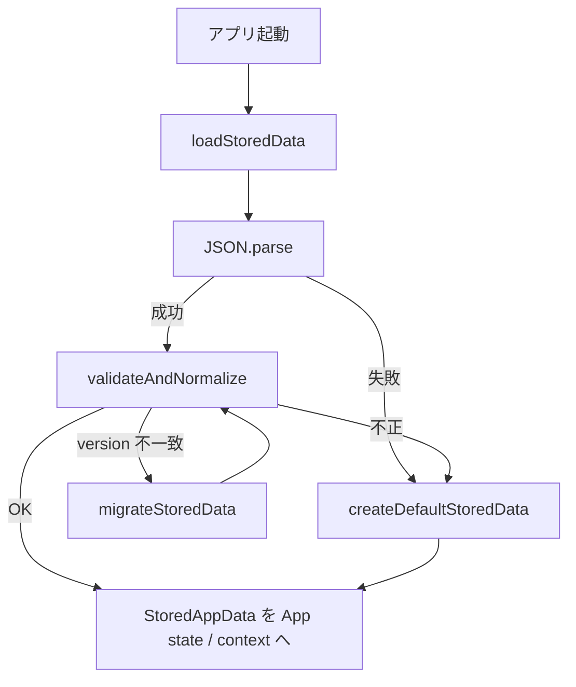
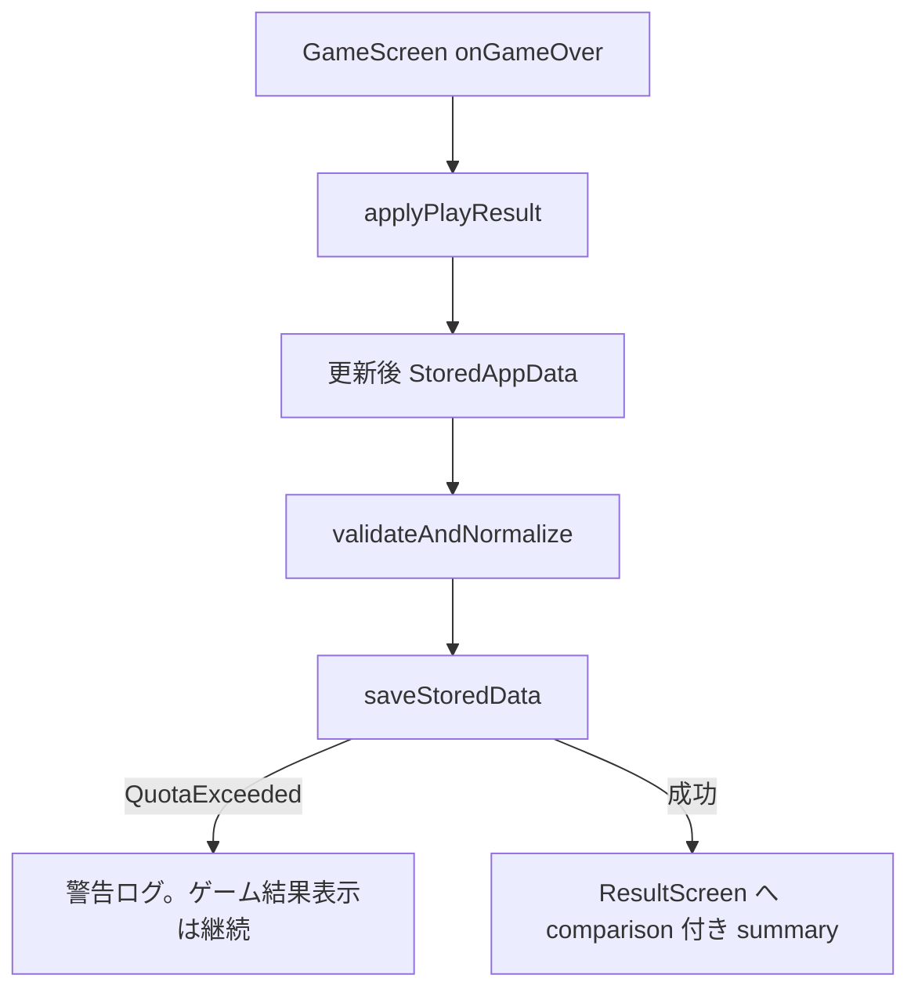

# Shinobi Keys — Phase 4 実装計画

**ステータス:** 計画のみ（未着手）  
**前提:** Phase 3 コミット済み（`feat: implement phase 3 romaji typing and stats`）  
**スコープ:** localStorage による記録保存・ベストスコア・履歴・前回比較・記録画面。音 / 一時停止 / 設定画面 UI は Phase 5

---

## 1. Phase 4 の目的

Phase 3 で計測可能になった `GameResultSummary` / `TypingStats` を **localStorage に永続化**し、難易度別ベスト・プレイ履歴・前回プレイとの比較を UI に反映する。記録専用画面を追加し、データ破損時もアプリが起動・プレイ可能な **安全なストレージ基盤** を確立する。

---

## 2. 保存するデータ構造

### 2.1 ルートスキーマ（`StoredAppData`）

`src/types/records.ts`（新規）に定義する。

```ts
/** 現行スキーマバージョン。gameConfig.storageVersion と一致させる */
export const STORAGE_SCHEMA_VERSION = 1

export interface StoredAppData {
  version: number
  settings: StoredSettings
  aggregates: StoredAggregates
  bestByDifficulty: Record<DifficultyId, BestRecord | null>
  recentPlays: PlayRecord[]
}

export interface StoredSettings {
  /** Phase 5 設定画面まで UI 未接続でも保持可能 */
  volume: number           // 0–1、初期 0.7
  muted: boolean           // 初期 false
  lastDifficulty: DifficultyId | null
  motionPreference: MotionPreference  // 初期 'system'
}

export interface StoredAggregates {
  totalPlays: number
  totalTypedChars: number
  bestComboAll: number
}

/** 難易度別ベスト（スコア優先。同点時は WPM → 正確率） */
export interface BestRecord {
  score: number
  wpm: number
  accuracy: number
  maxCombo: number
  stage: number
  destroyedTargets: number
  elapsedMs: number
  updatedAt: string        // ISO 8601
  playId: string           // 更新元 PlayRecord.id
}

/** 1プレイ分の履歴 */
export interface PlayRecord {
  id: string               // crypto.randomUUID() または timestamp+random
  playedAt: string         // ISO 8601
  difficulty: DifficultyId
  score: number
  stage: number
  destroyedTargets: number
  elapsedMs: number
  typedChars: number
  correctChars: number
  missCount: number
  accuracy: number
  wpm: number
  maxCombo: number
}

/** リザルト表示用：今回 vs 前回（同一難易度） */
export interface PlayComparison {
  previous: PlayRecord | null
  scoreDelta: number | null
  wpmDelta: number | null
  accuracyDelta: number | null
  isNewBestScore: boolean
  isNewBestWpm: boolean
  isNewBestAccuracy: boolean
}
```

### 2.2 Phase 3 からの入力

`GameResultSummary` → `PlayRecord` へ **純粋関数** で変換する。

| GameResultSummary | PlayRecord |
|-------------------|------------|
| `difficulty` | `difficulty` |
| `score` | `score` |
| `stage` | `stage` |
| `destroyedTargets` | `destroyedTargets` |
| `elapsedMs` | `elapsedMs` |
| `typedChars` | `typedChars` |
| `correctChars` | `correctChars` |
| `missCount` | `missCount` |
| `accuracy` | `accuracy` |
| `wpm` | `wpm` |
| `maxCombo` | `maxCombo` |

`rank` 文字列（S/A/B 等）は Phase 4 では **任意**。余裕があればスコア閾値で付与、なければ Phase 5 以降。

### 2.3 初期値

`createDefaultStoredData(): StoredAppData` を提供する。

- `bestByDifficulty`: 全難易度 `null`
- `recentPlays`: `[]`
- `aggregates`: すべて `0`
- `settings.lastDifficulty`: `null`

---

## 3. storage key / schema version

| 項目 | 値 | 定義場所 |
|------|-----|----------|
| **localStorage key** | `'shinobi-keys-data'` | 既存 `gameConfig.storageKey` |
| **schema version** | `1` | 既存 `gameConfig.storageVersion` + `STORAGE_SCHEMA_VERSION` |

- キーは **1 アプリ 1 キー**（設定・記録・集計を同一 JSON に格納）
- 将来スキーマ変更時は `version` をインクリメントし、マイグレーション関数で旧データを変換

---

## 4. 保存・読み込み処理の責務

### 4.1 モジュール分割

| モジュール | 責務 |
|------------|------|
| `src/types/records.ts` | 型・定数・デフォルト生成 |
| `src/utils/storageSchema.ts` | バリデーション・正規化・マイグレーション（純粋関数） |
| `src/utils/storage.ts` | localStorage I/O（読取・書込・削除） |
| `src/utils/recordPlay.ts` | `GameResultSummary` 適用 → 更新後 `StoredAppData` を返す（純粋） |
| `src/utils/comparePlay.ts` | 前回比較・ベスト更新判定（純粋） |
| `src/hooks/useStoredData.ts` | React からの読み書き窓口（任意。App 直読みでも可） |

### 4.2 読み込みフロー



- **原則:** 読取失敗・バリデーション失敗時も **デフォルトデータで起動継続**
- 破損データは `console.warn` のみ（本番 UI では Phase 4 では通知しない。Phase 6 で検討可）

### 4.3 保存フロー



- 保存タイミング: **ゲームオーバー確定時 1 回**（プレイ中の逐次保存はしない）
- `recentPlays` は先頭追加、`gameConfig.recentPlaysLimit`（50）で末尾切り捨て
- ベスト更新: スコア降順。同点時は WPM → 正確率 → 到達 stage

### 4.4 テスト容易性

- `storage.ts` は `StorageAdapter` インターフェース（`getItem` / `setItem` / `removeItem`）を受け取り、Vitest では in-memory 実装を注入
- ビジネスロジック（`recordPlay`, `comparePlay`, `storageSchema`）は **localStorage 非依存の純粋関数**

---

## 5. 変更予定ファイル一覧

### 5.1 新規作成

| ファイル | 役割 |
|----------|------|
| `src/types/records.ts` | ストレージ型・デフォルト |
| `src/utils/storageSchema.ts` | validate / normalize / migrate |
| `src/utils/storage.ts` | localStorage 読み書き |
| `src/utils/recordPlay.ts` | プレイ結果の反映 |
| `src/utils/comparePlay.ts` | 前回比較・ベスト判定 |
| `src/utils/storageSchema.test.ts` | バリデーション・マイグレーション |
| `src/utils/recordPlay.test.ts` | ベスト更新・履歴上限 |
| `src/utils/comparePlay.test.ts` | 比較 delta 計算 |
| `src/screens/RecordsScreen.tsx` | 記録画面 |
| `src/components/records/BestScoreCard.tsx` | 難易度別ベスト表示（任意分割） |
| `src/components/records/RecentPlaysList.tsx` | 履歴リスト（任意分割） |
| `src/components/records/PlayComparisonPanel.tsx` | リザルト比較 UI（任意分割） |

### 5.2 変更

| ファイル | 変更内容 |
|----------|----------|
| `src/types/app.ts` | `AppScreen` に `'records'` 追加 |
| `src/App.tsx` | 起動時 load、gameover 時 save、records 画面ルーティング |
| `src/screens/TitleScreen.tsx` | 「プレイ記録」を有効化、難易度別ベスト簡易表示 |
| `src/screens/DifficultyScreen.tsx` | 選択難易度のベスト / 前回スコア表示（任意） |
| `src/screens/ResultScreen.tsx` | 前回比較・ベスト更新バッジ |
| `src/screens/GameScreen.tsx` | onGameOver に storage 更新結果（comparison）を渡す |
| `src/types/game.ts` | `GameResultSummary` に `comparison?` または別 props 型 |
| `src/config/gameConfig.ts` | 必要なら `storageVersion` コメント整備（値は 1 のまま） |

### 5.3 作成しないもの（Phase 4 外）

- 設定画面 UI（Phase 5）
- 効果音・音量スライダー（Phase 5）
- 一時停止
- オンライン同期 / アカウント
- 空の将来用 hooks（`useLocalStorage.ts` を中身なしで作らない）

---

## 6. 画面遷移

### 6.1 現行（Phase 3）

```text
title → difficulty → game → result
         ↑__________________|
```

### 6.2 Phase 4 追加後

```text
                    ┌── records ──┐
                    │             │
title ──────────────┤             ├──→ title
  │                 └─────────────┘
  └── difficulty → game → result
        ↑_______________________|
```

| 遷移 | 操作 |
|------|------|
| title → records | 「プレイ記録」ボタン |
| records → title | 「タイトルへ戻る」 |
| title → difficulty | 「修行を始める」（従来通り） |
| difficulty → game | 「この難易度で開始」 |
| game → result | 防御 0（gameover） |
| result → game | リトライ |
| result → difficulty | 難易度変更 |
| result → title | タイトルへ |

### 6.3 各画面の Phase 4 表示追加

| 画面 | 追加内容 |
|------|----------|
| **TitleScreen** | 難易度別ベストスコア（3 行コンパクト）、記録ボタン有効化 |
| **DifficultyScreen** | 選択中難易度のベスト / 前回スコア（オプション） |
| **ResultScreen** | NEW BEST バッジ、前回比（±score / ±WPM / ±ACC）、ベストスコア表示 |
| **RecordsScreen** | 全難易度ベスト一覧、直近 N 件履歴、集計（総プレイ数等） |

---

## 7. テスト方針

### 7.1 純粋関数（重点）

| モジュール | ケース |
|------------|--------|
| `storageSchema` | 正常 JSON、欠損フィールド補完、型不正、version 0/未知、空オブジェクト |
| `storageSchema` migrate | v1→v1 は no-op。将来 v2 追加時のテスト枠を `@todo` で明示 |
| `recordPlay` | 初回プレイで best 設定、スコア更新、スコア未更新、recent 50 件上限 |
| `comparePlay` | 前回なし（全 delta null）、前回あり（delta 計算）、同点 |
| `comparePlay` | isNewBestScore / Wpm / Accuracy フラグ |

### 7.2 storage I/O

| ケース | 期待 |
|--------|------|
| キー未存在 | デフォルト返却 |
| 不正 JSON | デフォルト返却、クラッシュなし |
| setItem 成功 | 読み戻し一致 |
| QuotaExceededError | 例外捕捉、呼び出し側で結果表示継続 |

### 7.3 UI（軽量）

- `RecordsScreen`: データあり / 空状態のスナップショット or RTL  smoke
- `ResultScreen`: comparison props ありで NEW BEST 表示（RTL 1 件）

### 7.4 手動 / E2E

- 1 プレイ → リロード → ベスト・履歴が残る
- DevTools で localStorage 改ざん → 起動可能
- 前回比較がリザルトに表示される

---

## 8. データ移行方針

### 8.1 Phase 4 初回（version 1）

- 既存ユーザー: localStorage キー未存在 → `createDefaultStoredData()` を書き込まず **読取時のみデフォルト**（初回 gameover で初 save）
- Phase 3 までに手動でデータを入れていた場合も、version 不一致なら migrate または default

### 8.2 マイグレーション設計

```ts
type MigrationFn = (raw: unknown) => unknown

const migrations: Record<number, MigrationFn> = {
  // 1: (data) => data,  // 初版
  // 将来 2: migrateV1ToV2,
}

function migrateStoredData(raw: unknown): StoredAppData {
  // 1. version 抽出（なければ 0 扱い）
  // 2. 連鎖 migrate
  // 3. validateAndNormalize
}
```

### 8.3 後方互換

- **フィールド追加:** 欠損時はデフォルト値で merge（破壊的変更を避ける）
- **フィールド削除:** マイグレーションで strip。読取時に無視
- **リネーム:** マイグレーション関数で対応。1 バージョンに 1 関数

### 8.4 破損データ対応

| 状況 | 対応 |
|------|------|
| JSON parse 失敗 | デフォルト + warn |
| 必須フィールド欠損 | normalize で補完 |
| 数値が NaN / 負数 | クランプまたはデフォルト |
| `bestByDifficulty` に未知 difficulty | 無視または null |
| `recentPlays` が配列でない | `[]` に置換 |
| 完全に救えない | デフォルト。任意で `removeItem` 後に default 再 save（Phase 4 では自動 repair は **1 回のみ** 試行） |

---

## 9. 想定リスクと対策

| # | リスク | 対策 |
|---|--------|------|
| 1 | localStorage 破損で白画面 | 読取は try/catch + validate。React 初期化前に完結 |
| 2 | スキーマ変更で既存データ読めない | version + migrate 連鎖。テストで旧 JSON fixture |
| 3 | 保存失敗（容量・プライベートモード） | save は boolean 返却。リザルト表示は storage 成否に非依存 |
| 4 | ベスト判定の揺れ（同点時） | 優先順位を固定（score → wpm → accuracy → stage）し Vitest で固定 |
| 5 | 前回比較の対象が曖昧 | **同一難易度の直近 1 件**（今回保存前の recentPlays 先頭）を「前回」と定義 |
| 6 | App.tsx の肥大化 | load/save は `storage.ts`、`applyPlayResult` は純粋関数。App は orchestration のみ |
| 7 | SSR / テスト環境で localStorage 不在 | `typeof window === 'undefined'` 時は no-op / メモリ fallback |
| 8 | 時刻改ざん | `playedAt` は参考値。ランキング用途ではないため許容 |
| 9 | UUID 非対応環境 | `crypto.randomUUID` 不可時は `Date.now()-random` フォールバック |

---

## 10. 実装ステップ（Phase 4 内の順序）

### Step 1 — 型とデフォルト
- `records.ts`、`createDefaultStoredData`

### Step 2 — スキーマ層
- `validateAndNormalize`、`migrateStoredData`（v1 no-op）
- Vitest: 正常・欠損・不正

### Step 3 — 記録ロジック
- `recordPlay.ts`、`comparePlay.ts`
- Vitest: ベスト更新・履歴・比較

### Step 4 — storage I/O
- `storage.ts` + in-memory adapter テスト

### Step 5 — App 接続
- 起動 load、gameover save、state 保持

### Step 6 — UI
- ResultScreen 比較・NEW BEST
- RecordsScreen
- TitleScreen ベスト表示・記録ボタン

### Step 7 — 品質
- lint / test / build
- 手動: 改ざん localStorage / リロード persistence

---

## 11. Phase 4 完了条件

- [ ] gameover 時に PlayRecord が localStorage へ保存される
- [ ] 難易度別ベストが更新・表示される
- [ ] 直近 50 件の履歴が RecordsScreen で確認できる
- [ ] ResultScreen に前回比較（±）と NEW BEST 表示がある
- [ ] TitleScreen から記録画面へ遷移できる
- [ ] schema version 1 + 不正データフォールバックが動作する
- [ ] Vitest 追加、lint / test / build 成功
- [ ] リロード後も記録が残ることを手動確認

---

## 12. Phase 4 で実装しないもの

- 効果音・BGM（Phase 5）
- 一時停止（Phase 5）
- 設定画面 UI（Phase 5。`settings` フィールドは保持のみ）
- オンラインランキング / アカウント
- ローマ字規則の追加拡張（Phase 3 継続改善は別途可）

---

## 13. Phase 5 への引き継ぎ

Phase 4 完了時点で以下が利用可能になる:

- `StoredAppData`（settings 含む）
- `loadStoredData` / `saveStoredData`
- RecordsScreen / リザルト比較 UI

Phase 5 では `settings.volume` / `muted` / `motionPreference` を設定画面と接続し、効果音・一時停止を追加する。
