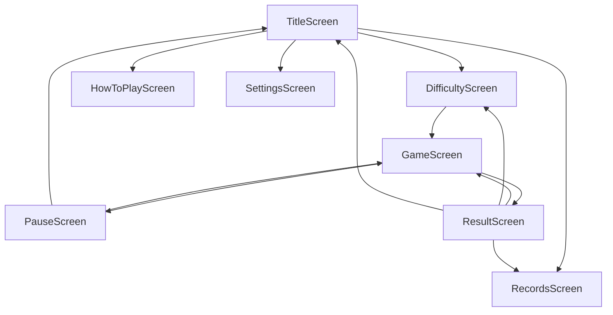
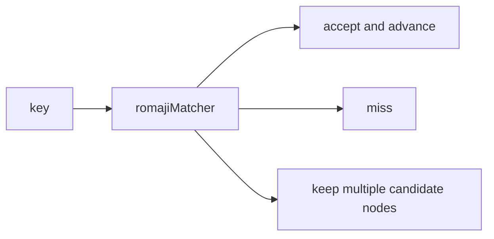

# Shinobi Keys 改訂実装計画

**本計画提示時点で実装は開始しない。** ユーザー確認後に着手する。

---

## 1. 先の計画が要件と異なっていた理由

| 先の方針 | 問題点 |
|----------|--------|
| `simple_typing_game.html` を完成版へ作り替え | 参考資料を土台と誤認した |
| 単一 `index.html` 完結 | React/TS への再設計要件と矛盾 |
| フレームワーク不使用 | 採用技術（React / Vite / TS）を無視した |
| 既存 HTML の JS に機能追加 | DOM 操作中心を引き継ぎ、責務分離できない |
| 音・上達記録をスコープ外 | 要件の重要機能を独自判断で削除した |

本計画は上記を破棄し、落下ゲーム＋継続練習・数値での上達確認アプリとして再設計する。

---

## 2. 修正後の技術構成

| 採用 | 不採用 |
|------|--------|
| React, TypeScript, Vite, Tailwind CSS, Vitest, npm | Next.js |
| localStorage | Firebase / Supabase / DB |
| Web Audio API（仮音→後から音源差し替え） | 外部ログイン・バックエンド・有料 API |
| 必要時のみ Canvas API | Redux 等の大規模状態管理ライブラリ |

アプリ名は仮称 **Shinobi Keys**（補助表記: タイピング修行）。[`src/config/appConfig.ts`](src/config/appConfig.ts) で一元管理し、後から変更可能にする。

現状リポジトリは [`simple_typing_game.html`](simple_typing_game.html) のみ。Phase 1 で Vite プロジェクトを新規初期化し、参考 HTML は **削除せず残す**（デザイン参照用）。

---

## 3. 参考 HTML から引き継ぐ要素

- 忍者テーマの世界観・ダークブルー配色
- 忍者キャラクター / 手裏剣型ターゲット
- 上から単語が落下する表現
- 正解時の攻撃アニメ・斬撃エフェクト
- スコア・コンボ・ステージ・防衛壁 UI
- 入力済み文字の色分け（correct / pending / incorrect）
- タイトル・リザルトの雰囲気
- レトロゲーム風フォント（Press Start 2P + 日本語用フォント）

---

## 4. 参考 HTML から引き継がない要素

- 単一 HTML / インライン script 構造
- DOM 直接操作中心のゲームループ
- 英単語フラット配列のみの問題データ
- レベル進行だけで難易度が変わる方式（選択可能な 3 難易度設定に置換）
- タイトル即 START のみの画面構成
- Tailwind CDN（Vite の Tailwind ビルドに置換）
- アプリ名・コピー文言（Shinobi Keys 用に再設計）

---

## 5. 画面一覧

React の画面状態（`AppScreen`）で切替。独立 URL は必須としない。巨大な `App.tsx` には書かず、各 Screen コンポーネントに分離する。



| # | 画面 | 主な内容 |
|---|------|----------|
| 1 | タイトル | ロゴ、キャッチ「打て。斬れ。タイピングを極めろ。」、開始/難易度/遊び方/記録/設定、難易度別最高記録 |
| 2 | 難易度選択 | 修行生・忍者・忍頭の説明とパラメータ要約、選択して開始 |
| 3 | 遊び方 | 操作説明・ロックオン・コンボ・初心者向けガイド |
| 4 | ゲーム | 落下迎撃プレイ本体 |
| 5 | 一時停止 | 再開・設定（音量）・タイトルへ |
| 6 | リザルト | 詳細統計・過去最高/前回差・再戦導線 |
| 7 | プレイ記録 | 履歴一覧・難易度別ベスト |
| 8 | 設定 | 音量・ミュート・reduced motion 等 |

### ゲーム HUD の情報優先度

タイピングを妨げないため、表示を層分けする。

- **常時・大きめ**: スコア、コンボ、防衛壁、落下ターゲット、忍者
- **常時・コンパクト**: ステージ、選択難易度
- **二次（小さめ or 折りたたみ可）**: 経過時間、WPM、正確率
- **操作**: 一時停止・音量（キーボードショートカット併用、フォーカスを奪わない）

---

## 6. 機能一覧

すべてスコープ内。削除せず Phase で分割する。

- 3 難易度と明確に異なるバランス
- 速度計測 / WPM / 正確率 / ミスタイプ数 / 最高コンボ
- 難易度別最高記録・プレイ履歴・前回比較・localStorage
- 日本語問題のローマ字入力・複数パターン対応可能な判定設計
- 一時停止・音量・ミュート・キーボード操作
- アクセシビリティ（フォーカス、aria、reduced motion）・レスポンシブ
- 効果音（Web Audio 仮音 → 差し替え可能な SoundManager）

オンラインランキングは不要（要件どおり）。

---

## 7. コンポーネント構成

ユーザー提示の構成を基準とし、現状（空リポジトリ＋参考 HTML）に合わせて採用する。変更点は次のみ。

- `features/game/` に `GameProvider`（Context + useReducer）を追加し、画面横断の記録・設定は `features/records/` / `features/settings/` に分離
- `styles/tokens.css`（または `src/styles/theme.css`）でデザイントークンを明示

```
src/
  components/
    common/          GameButton, Modal, ScreenShell, RankBadge
    game/            GameArea, GameHud, NinjaPlayer, FallingTarget,
                     ComboDisplay, DefenseGauge, SlashEffect
  screens/           Title, Difficulty, HowToPlay, Game, Pause,
                     Result, Records, Settings
  config/            appConfig, difficultyConfig, gameConfig
  data/              typingProblems.ts
  features/
    game/            gameReducer, gameLogic, targetSpawner, GameProvider
    records/         recordsService（読取・比較・更新）
    settings/        settingsService
    sound/           SoundManager
  hooks/             useGameLoop, useKeyboardInput, useLocalStorage, useSound
  types/             app, game, typing, records
  utils/             calculateScore, calculateTypingStats, romajiMatcher,
                     storage, selectTypingProblem
  styles/            tokens.css, index.css
  App.tsx            画面ルータのみ（薄い）
  main.tsx
```

`simple_typing_game.html` はリポジトリ直下に参考として残す。

---

## 8. ゲーム状態の管理方法

**採用: Context + useReducer（ゲームセッション）＋描画用 useRef 分離＋設定/記録用カスタムフック**

採用理由:

- 画面・スコア・ターゲット・統計など遷移が多い → `useReducer` で意図を action 化しテストしやすい
- タイトル〜記録画面で設定・ベストを共有 → 薄い Context（ゲーム用と設定/記録用を分ける）
- 毎フレームの座標更新を React state に載せない → `useRef` + rAF で描画し、UI 向け state は低頻度更新

整理する状態:

| 領域 | 内容 |
|------|------|
| ナビ | `currentScreen` |
| セッション | 難易度、`playing`/`paused`/`gameover`、スコア、体力、コンボ、ステージ、ロックオン ID、アクティブターゲットの論理状態 |
| 統計 | 入力数・正解数・ミス・経過時間・WPM・正確率・撃破数・maxCombo |
| 設定 | 音量・ミュート・`motionPreference`（system/reduced/full）・最後の難易度 |
| 記録 | 難易度別ベスト・履歴・総プレイ回数等 |

大規模外部ライブラリは使わない。

---

## 9. requestAnimationFrame の使用方針

[`useGameLoop.ts`](src/hooks/useGameLoop.ts):

1. `playing && !paused` のときのみ rAF を回す
2. `deltaTime` で落下位置を `targetsRef` 上で更新
3. DOM/CSS（`transform: translate3d`）または少数ターゲットの専用サブツリーへ直接反映し、**毎フレーム `setState` しない**
4. React state 更新はイベント時（入力・撃破・ダメージ・スポーン・ステージアップ）と、統計表示用の間引き（例: 200–250ms）に限定
5. 一時停止で rAF 停止、再開で時刻基準をリセットしてジャンプを防ぐ
6. `reduced-motion` 時は落下補間を簡略化し、演出アニメを短縮/オフ

Canvas は必須としない。初期は DOM + CSS。ターゲット数が増え描画がボトルネックになった場合のみ Canvas を検討する。

---

## 10. 日本語ローマ字判定の設計方針

**問題データと判定ロジックを必ず分離する。**

- データ: `displayText` / `reading` / `romajiPatterns`（完成候補）＋将来用メタ
- 判定: [`romajiMatcher.ts`](src/utils/romajiMatcher.ts) が「読み」またはパターンから **入力途中の受理可能プレフィックス** を返す

拡張可能なモデル（Phase 3 で骨格、規則は段階実装）:



- かな単位のノードと、各ノードのローマ字候補（`し→shi|si` 等）を持つ **トライ / 候補集合**
- 入力ごとに候補を絞り込み。全滅でミス、一意に進めば確定
- 完成文字列配列だけに依存しない（途中分岐のため）
- Phase 3 初期: よく使う清音・濁音・主要拗音・`ん`/`っ` の基本
- 長音・全パターン網羅は同ファイル内に規則テーブルを足せる設計にし、未対応はテストで明示

ロックオン・「同一先頭なら最危険優先」は参考 HTML の挙動を `gameLogic` に移植する。

---

## 11. 難易度設定

[`src/config/difficultyConfig.ts`](src/config/difficultyConfig.ts) のみで管理。ゲームコンポーネントに直書きしない。

キー: `trainee`（修行生） / `ninja`（忍者） / `master`（忍頭）。`jonin` は使用しない。

各エントリ最低限:

- `id`, `displayName`, `description`
- `fallSpeed`, `fallSpeedPerStage`
- `spawnIntervalMs`, `minSpawnIntervalMs`, `maxActiveTargets`
- `minChars`, `maxChars`, `problemCategories`
- `missDamage`, `killHeal`
- `scoreMultiplier`, `comboMultiplier`
- `stageUpCondition`（例: score 閾値 or 撃破数）

仮のバランス例（調整しやすい数値）:

| | 修行生 | 忍者 | 忍頭 |
|--|--------|------|------|
| 落下 | 遅い | 標準 | 速い |
| 出現 | 長い | 標準 | 短い |
| 同時数 | 少 | 中 | 多 |
| 問題 | 短・基本キー | 中・短文混在 | 長文・難語・IT |
| ミスダメ | 軽 | 中 | 大 |
| ガイド | あり | なし | なし |

---

## 12. 問題データ構造

[`src/data/typingProblems.ts`](src/data/typingProblems.ts) + [`src/types/typing.ts`](src/types/typing.ts)

```ts
type DifficultyId = 'trainee' | 'ninja' | 'master';
type MotionPreference = 'system' | 'reduced' | 'full'; // system=OSに従う / reduced=抑制 / full=通常。初期値 system
type ProblemCategory = 'basic' | 'food' | 'nature' | 'it' | 'phrase' | 'english';

interface TypingProblem {
  id: string;
  displayText: string;      // 画面表示（日本語 or 英語）
  reading: string;          // ローマ字化の根拠（かな等）。英語は表示と同じ可
  romajiPatterns: string[]; // 完成形候補（シード/テスト用）。判定本体は matcher
  difficulty: DifficultyId;
  category: ProblemCategory;
  baseScore: number;
}
```

英単語のみに限定しない。抽選は [`selectTypingProblem.ts`](src/utils/selectTypingProblem.ts) が難易度・文字数・カテゴリ・重複回避を担当。

---

## 13. localStorage のデータ構造

[`src/utils/storage.ts`](src/utils/storage.ts) + バージョン付きスキーマ。

```ts
interface StoredAppData {
  version: number; // 現行 1。マイグレーション関数で更新
  settings: {
    volume: number;      // 0–1
    muted: boolean;
    lastDifficulty: DifficultyId;
    motionPreference: MotionPreference; // 'system' | 'reduced' | 'full'（初期値 system）。prefers-reduced-motion とアプリ設定を区別
  };
  aggregates: {
    totalPlays: number;
    totalTypedChars: number;
    bestComboAll: number;
  };
  bestByDifficulty: Record<DifficultyId, {
    score: number;
    wpm: number;
    accuracy: number;
    maxCombo: number;
    updatedAt: string;
  }>;
  recentPlays: PlayRecord[]; // 上限あり（例: 50）
}

interface PlayRecord {
  id: string;
  playedAt: string;
  difficulty: DifficultyId;
  score: number;
  stage: number;
  durationMs: number;
  typedChars: number;
  correctChars: number;
  misses: number;
  accuracy: number;
  wpm: number;
  maxCombo: number;
  wordsCleared: number;
  rank: string;
}
```

不正 JSON・古い形式・欠損フィールドはデフォルトへフォールバックし、アプリを落とさない。読取失敗時は初期データで継続。

---

## 14. 作成予定ファイル（主要）

Phase 1 でスキャフォールドし、以降フェーズで中身を埋める。

- ルート: `package.json`, `vite.config.ts`, `tsconfig*.json`, `tailwind.config.*`, `index.html`（Vite 入口）, `README.md`, `vitest` 設定
- `src/main.tsx`, `src/App.tsx`
- `src/config/{app,difficulty,game}Config.ts`
- `src/types/{app,game,typing,records}.ts`
- `src/data/typingProblems.ts`
- `src/features/game/{gameReducer,gameLogic,targetSpawner,GameProvider}.ts(x)`
- `src/hooks/{useGameLoop,useKeyboardInput,useLocalStorage,useSound}.ts`
- `src/utils/{calculateScore,calculateTypingStats,romajiMatcher,storage,selectTypingProblem}.ts`
- `src/components/common/*`, `src/components/game/*`
- `src/screens/*Screen.tsx`
- `src/styles/{tokens,index}.css`
- `src/**/*.test.ts`（Phase 6 中心、ロジックは Phase 3–4 から先行可）

参考: `simple_typing_game.html`（変更しない／参照のみ）

---

## 15. 実装フェーズ

機能は削除せず段階実装する。

### Phase 1 — プロジェクト基盤（補足: Prompt.md）
Vite + React + TS + Tailwind + Vitest + ESLint。**必要ファイルのみ作成**（空の将来用ファイル・未使用 hooks/utils は作らない）。難易度 ID は `trainee` / `ninja` / `master`。`MotionPreference = 'system' | 'reduced' | 'full'`（初期値 system）。画面はタイトル＋難易度選択の骨格のみ。ゲームロジック・rAF・storage・音は実装しない。

rAF 利用時（Phase 2以降）: 高頻度描画（座標/transform）のみ DOM 直接更新可。アクティブ一覧・入力・スコア等の論理状態は React を正とし、撃破・到達判定の座標は単一 `targetsRef` を正とする。

### Phase 2 — 基本ゲーム
タイトル・難易度選択・ゲーム・基本リザルト。落下・キーボード・ロックオン・攻撃・ダメージ・ゲーム終了。判定は暫定（英字 / 単一パターン）でも可だが、最終 API に合わせたインターフェースで置く。

### Phase 3 — タイピング判定
日本語問題データ投入、`romajiMatcher`、複数パターン、ミス処理、WPM・正確率・詳細統計を HUD / リザルトへ。

### Phase 4 — 記録と上達
localStorage、最高記録、履歴、前回比較、自己ベスト更新表示、記録画面、タイトルの難易度別ベスト。

### Phase 5 — 演出と設定
SoundManager（仮 Web Audio → 差し替え可能）、音量/ミュート、一時停止、アニメ調整、reduced motion、レスポンシブ、a11y（ラベル・フォーカストラップ・キーボードのみ操作）。

### Phase 6 — テストと品質
Vitest 拡充、lint、build、バランス調整、キーボード確認、storage 異常系、README。

---

## 16. テスト方針（Vitest）

最低限カバー:

- スコア計算・コンボ倍率
- WPM・正確率
- 難易度設定の整合（必須キー・値の妥当性）
- 問題抽選（カテゴリ・文字数制約）
- ローマ字入力判定（分岐・ミス・完成）
- localStorage 初期値・不正データ・バージョン移行

ゲームループのピクセル座標までは必須とせず、純関数（`utils` / `gameLogic` の決定的部分）を優先する。

---

## 17. 想定される技術的リスク

1. 毎フレーム React 再レンダーによるパフォーマンス低下
2. ローマ字の曖昧さ（`ん`、`っ`、複数表記）による誤判定
3. localStorage 破損・スキーマ変更で起動不能
4. 音源未用意でもイベント配線が後回しになり結合が壊れる
5. HUD 情報過多でプレイ体験が落ちる
6. 難易度パラメータの散在による調整不能
7. フォーカス喪失で入力が効かない（Web あるある）

---

## 18. 各リスクへの対策

| リスク | 対策 |
|--------|------|
| 1 再レンダー | rAF + `useRef` 描画、state はイベント/間引き更新（§9） |
| 2 ローマ字 | 候補集合マッチア、規則テーブル拡張、単体テストで回帰防止（§10） |
| 3 storage | `version` + マイグレーション、parse 失敗時デフォルト、書込前バリデーション（§13） |
| 4 音 | Phase 5 前でも SoundManager インターフェースを早期に定義し、無音/オシレータで呼び出し点を固定 |
| 5 HUD | 情報優先度の層分け（§5）、モバイルは二次情報を縮小 |
| 6 難易度散在 | `difficultyConfig` 単一ソース、コンポーネント直書き禁止（§11） |
| 7 フォーカス | 隠れ input or `keydown` on window、GameArea クリックで再フォーカス、一時停止中はショートカットのみ |

---

## 確認待ち

本計画の承認後に Phase 1（プロジェクト初期化）から着手する。承認前はファイル作成・編集・削除・`npm install`・初期化・コミットを行わない。
